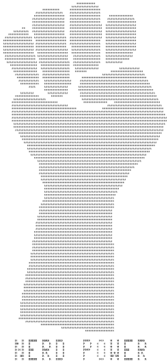

# FIST — Emphatic Message Generator

[*FIST*](https://www.fourmilab.ch/fist/)
prints an image of a clenched fist (unless suppressed by the -c
option), followed by a slogan in block letters, limited to 16
characters per line (“Television is to news as bumper stickers are to
philosophy.”—Richard M. Nixon).   Options permit you to scale the fist
commensurate to the iniquities of the Oppressor (or your printer's
paper size, whichever is smaller), select right- or left-handed blows
against the Empire, and various other gimmicks which popped into the
mind of this humble programmer while watching Ice Station Zebra over
and over again and watching his fingernails grow. Oh, wait…wrong
megalomaniac. Anyway, here's the latest incarnation of the FIST
program. May your banners ever espouse worthy causes, and may those
truly worthy be achieved.

This repository maintains the master copies of the *FIST* source code
and the Web tree for the program.

## Structure of the repository

This repository is organised into the following directories.

* **webtree**: Replica of the Web tree from the Fourmilab site
containing all of the HTML documents, and images.  These
pages contain relative references to style sheets, icons, and other
resources on the Fourmilab Web site and will not display properly
without modification in other environments.

* **src**: Source code for the *FIST* program, written in ANSI C
using the Literate Programming methodology.  The program and
documentation is defined in the CWEB file **fist.w**.  The C source
code and TeX documentation are generated automatically from this file.
All modifications to the program should be made to the **fist.w**
file and the generated files rebuilt.

